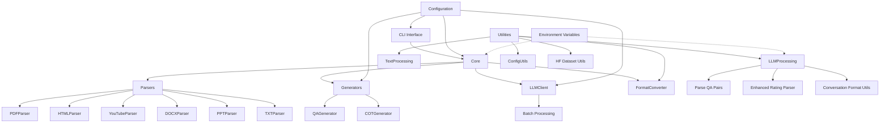
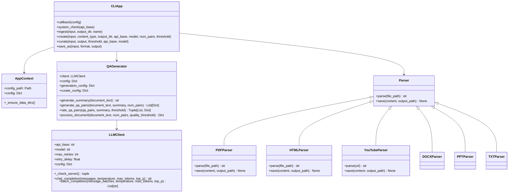
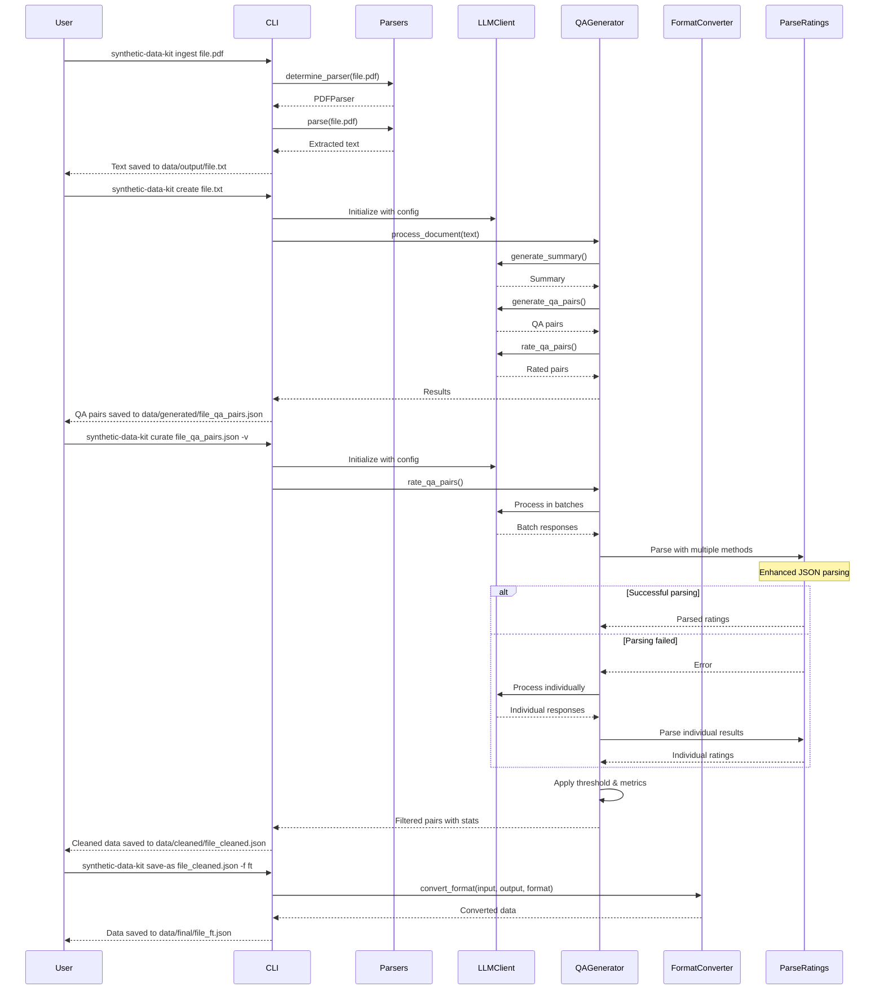
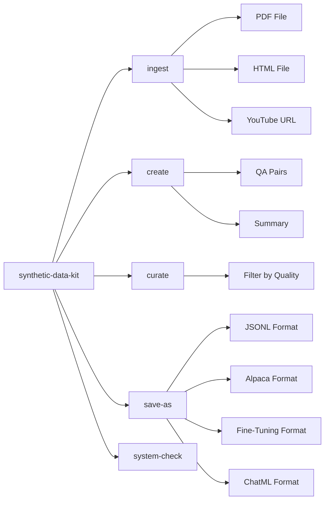
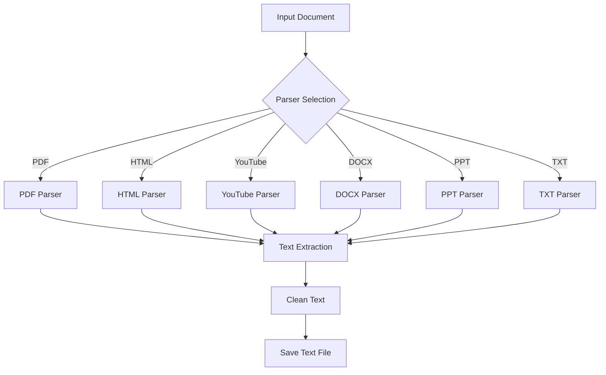
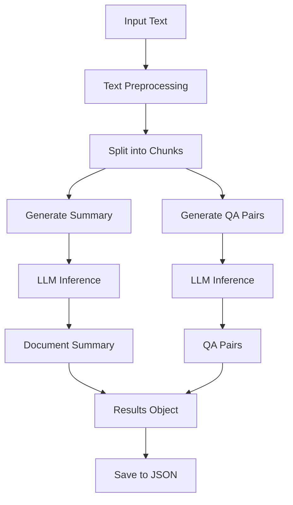
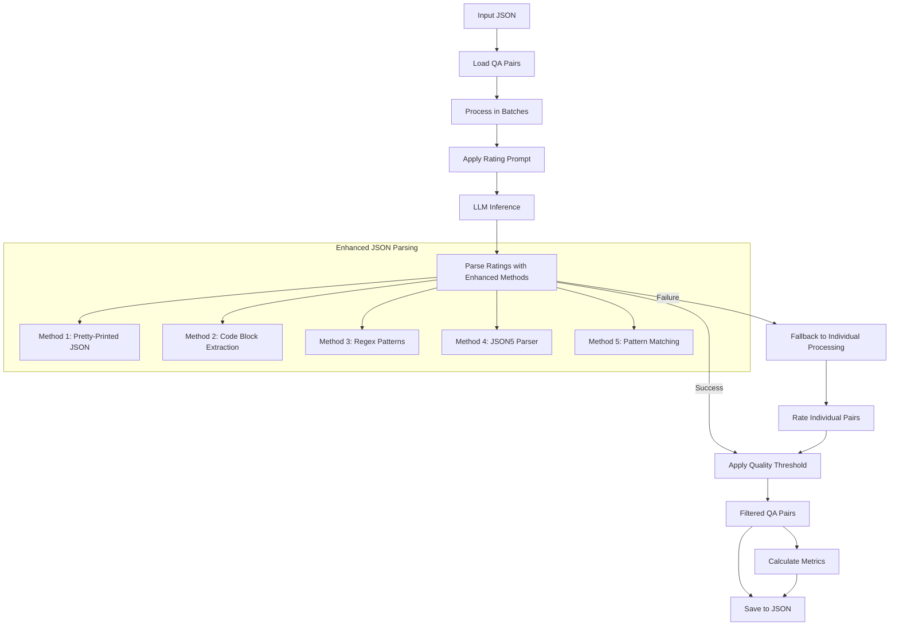
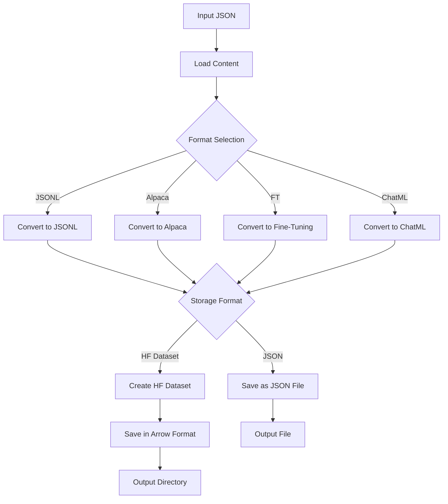

# Synthetic Data Kit: Comprehensive Documentation

## Table of Contents

1. [Overview](#1-overview)
2. [Architecture](#2-architecture)
3. [Installation](#3-installation)
4. [CLI Interface](#4-cli-interface)
5. [Configuration System](#5-configuration-system)
6. [Pipeline Stages](#6-pipeline-stages)
7. [Component Reference](#7-component-reference)
8. [Output Formats](#8-output-formats)
9. [Environment Variables](#9-environment-variables)
10. [Workflow Examples](#10-workflow-examples)
11. [Customizing Prompts](#11-customizing-prompts)
12. [Extending the Toolkit](#12-extending-the-toolkit)
13. [Troubleshooting](#13-troubleshooting)
14. [Best Practices](#14-best-practices)

## 1. Overview

Synthetic Data Kit is a toolkit for preparing high-quality synthetic datasets to fine-tune Large Language Models (LLMs). It provides a modular command-line interface (CLI) for the complete data preparation workflow, with 4 simple commands named after their respective actions.

### Design:

- **Document Parsing**: Convert various file formats (PDF, HTML, YouTube, DOCX, PPTX, TXT) to clean text
- **Content Generation**: Generate high-quality QA pairs using local LLM inference
- **Quality Control**: Filter content based on quality metrics
- **Format Conversion**: Export to various training formats (JSONL, Alpaca, OpenAI FT, ChatML)
- **Configurable**: All aspects controlled via YAML configuration
- **Extensible**: Easy to add new parsers, generators, or output formats

## 2. Architecture

### System Overview

Synthetic Data Kit follows a modular architecture with these main components:



### Directory Structure

```
synthetic-data-kit/
├── synthetic_data_kit/        # Package source code
│   ├── __init__.py           # Package initialization
│   ├── cli.py                # CLI entry point using Typer
│   ├── core/                 # Core functionality
│   │   ├── __init__.py
│   │   ├── context.py        # Application context
│   │   ├── ingest.py         # Document ingestion
│   │   ├── create.py         # Content creation
│   │   ├── cleanup.py        # Content filtering
│   │   └── save_as.py        # Format conversion
│   ├── models/               # LLM integration
│   │   ├── __init__.py
│   │   └── llm_client.py     # VLLM client
│   ├── parsers/              # Document parsers
│   │   ├── __init__.py
│   │   ├── pdf_parser.py     # PDF parser
│   │   ├── html_parser.py    # HTML parser
│   │   ├── youtube_parser.py # YouTube parser
│   │   ├── docx_parser.py    # DOCX parser
│   │   ├── ppt_parser.py     # PPT parser
│   │   └── txt_parser.py     # TXT parser
│   ├── generators/           # Content generators
│   │   ├── __init__.py
│   │   └── qa_generator.py   # QA pair generator
│   └── utils/                # Utilities
│       ├── __init__.py
│       ├── config.py         # Config handling
│       ├── text.py           # Text processing
│       ├── llm_processing.py # LLM output parsing
│       └── format_converter.py # Format conversion
├── configs/                  # Configuration files
│   └── config.yaml           # Default configuration
├── data/                     # Data directories
│   ├── pdf/                  # Input PDFs
│   ├── html/                 # Input HTML files
│   ├── youtube/              # YouTube transcripts
│   ├── docx/                 # Input Word documents
│   ├── ppt/                  # Input PowerPoint files
│   ├── txt/                  # Input text files
│   ├── output/               # Parsed text outputs
│   ├── generated/            # Generated content
│   ├── cleaned/              # Filtered content
│   └── final/                # Formatted outputs
├── setup.py                  # Package setup script
├── pyproject.toml            # Project metadata
├── MANIFEST.in               # Package manifest
└── README.md                 # Project readme
```

### Class Diagram



### Data Flow



## 3. Installation

### Requirements

- Python 3.8 or later
- VLLM for local inference (recommended)

### Installation Methods

#### From PyPI

```bash
pip install synthetic-data-kit
```

#### From Source

```bash
git clone https://github.com/meta-llama/synthetic-data-kit.git
cd synthetic-data-kit
pip install -e .
```

### Setting Up VLLM

For local inference, you'll need to install and run VLLM:

```bash
pip install vllm

# Start the VLLM server with your preferred model
vllm serve meta-llama/Llama-3.3-70B-Instruct --port 8000
```

## 4. CLI Interface

Synthetic Data Kit provides a Typer-based CLI interface with subcommands for each stage of the pipeline.

### Command Structure

```
synthetic-data-kit [OPTIONS] COMMAND [ARGS]...
```

### Global Options

| Option | Description |
|--------|-------------|
| `-c, --config PATH` | Path to custom configuration file |
| `--help` | Show help message |

### Commands Overview



### `system-check` Command

Verifies if the VLLM server is running.

```bash
synthetic-data-kit system-check [OPTIONS]
```

#### Options:

| Option | Description |
|--------|-------------|
| `--api-base TEXT` | VLLM API base URL to check |

#### Example:

```bash
# Check default server
synthetic-data-kit system-check

# Check specific server
synthetic-data-kit system-check --api-base="http://localhost:8000/v1"
```

### `ingest` Command

Parses documents into clean text.

```bash
synthetic-data-kit ingest [OPTIONS] INPUT
```

#### Arguments:

| Argument | Description |
|----------|-------------|
| `INPUT` | File or URL to parse |

#### Options:

| Option | Description |
|--------|-------------|
| `-o, --output-dir PATH` | Directory to save parsed text |
| `-n, --name TEXT` | Custom filename for output |

#### Examples:

```bash
# Parse a PDF file
synthetic-data-kit ingest documents/paper.pdf

# Parse with custom output directory
synthetic-data-kit ingest documents/paper.pdf -o custom_dir/

# Parse a web page
synthetic-data-kit ingest "https://example.com/article"

# Parse a YouTube video
synthetic-data-kit ingest "https://www.youtube.com/watch?v=dQw4w9WgXcQ"
```

### `create` Command

Generates content from text files.

```bash
synthetic-data-kit create [OPTIONS] INPUT
```

#### Arguments:

| Argument | Description |
|----------|-------------|
| `INPUT` | Text file to process |

#### Options:

| Option | Description |
|--------|-------------|
| `--type TEXT` | Content type to generate [qa\|summary\|cot] |
| `-o, --output-dir PATH` | Directory to save generated content |
| `--api-base TEXT` | VLLM API base URL |
| `-m, --model TEXT` | Model to use |
| `-n, --num-pairs INTEGER` | Number of QA pairs to generate |
| `--threshold FLOAT` | Quality threshold (1-10) |

#### Examples:

```bash
# Generate QA pairs
synthetic-data-kit create data/output/document.txt

# Specify number of pairs
synthetic-data-kit create data/output/document.txt -n 30

# Generate summary only
synthetic-data-kit create data/output/document.txt --type summary

# Generate Chain of Thought (CoT) reasoning examples
synthetic-data-kit create data/output/document.txt --type cot

# Use custom model
synthetic-data-kit create data/output/document.txt -m "meta-llama/Llama-3.3-8B-Instruct"
```

### `curate` Command

Filters content based on quality.

```bash
synthetic-data-kit curate [OPTIONS] INPUT
```

#### Arguments:

| Argument | Description |
|----------|-------------|
| `INPUT` | File with QA pairs to clean |

#### Options:

| Option | Description |
|--------|-------------|
| `-o, --output PATH` | Output file path |
| `-t, --threshold FLOAT` | Quality threshold (1-10) |
| `--api-base TEXT` | VLLM API base URL |
| `-m, --model TEXT` | Model to use |

#### Examples:

```bash
# Clean with default settings
synthetic-data-kit curate data/generated/document_qa_pairs.json

# Set higher quality threshold
synthetic-data-kit curate data/generated/document_qa_pairs.json -t 8.5

# Specify output location
synthetic-data-kit curate data/generated/document_qa_pairs.json -o custom_path.json
```

### `save-as` Command

Converts content to different formats.

```bash
synthetic-data-kit save-as [OPTIONS] INPUT
```

#### Arguments:

| Argument | Description |
|----------|-------------|
| `INPUT` | File to convert |

#### Options:

| Option | Description |
|--------|-------------|
| `-f, --format TEXT` | Output format [jsonl\|alpaca\|ft\|chatml] |
| `--storage TEXT` | Storage format [json\|hf] (default: json) |
| `-o, --output PATH` | Output file path |

#### Examples:

```bash
# Convert to JSONL format
synthetic-data-kit save-as data/cleaned/document_cleaned.json -f jsonl

# Convert to fine-tuning format (JSON file)
synthetic-data-kit save-as data/cleaned/document_cleaned.json -f ft

# Convert to fine-tuning format (HF dataset)
synthetic-data-kit save-as data/cleaned/document_cleaned.json -f ft --storage hf

# Convert to ChatML format (HF dataset) with specific output location 
synthetic-data-kit save-as data/cleaned/document_cleaned.json -f chatml --storage hf -o data/final/custom_name
```

## 5. Configuration System

Synthetic Data Kit uses a YAML-based configuration system with a central config file.

### Configuration File Structure

```yaml
# paths: Configure input and output paths
paths:
  input:
    pdf: "data/pdf"
    html: "data/html"
    youtube: "data/youtube"
    docx: "data/docx"
    ppt: "data/ppt"
    txt: "data/txt"
  output:
    parsed: "data/output"
    generated: "data/generated"
    cleaned: "data/cleaned"
    final: "data/final"

# vllm: Configure VLLM server settings
vllm:
  api_base: "http://localhost:8000/v1"
  port: 8000
  model: "meta-llama/Llama-3.3-70B-Instruct"
  max_retries: 3
  retry_delay: 1.0

# generation: Content generation parameters
generation:
  temperature: 0.7
  top_p: 0.95
  chunk_size: 4000
  overlap: 200
  max_tokens: 4096
  num_pairs: 25
  batch_size: 32    # Number of requests to batch together

# curate: Content filtering parameters
curate:
  threshold: 7.0
  batch_size: 8
  temperature: 0.1

# format: Export format parameters
format:
  default: "jsonl"
  include_metadata: true
  pretty_json: true

# prompts: LLM prompts for different tasks
prompts:
  summary: |
    Summarize this document in 3-5 sentences, focusing on the main topic and key concepts.

  qa_generation: |
    Create {num_pairs} question-answer pairs from this text for LLM training.
    
    Rules:
    1. Questions must be about important facts in the text
    2. Answers must be directly supported by the text
    3. Return JSON format only:
    
    [
      {{
        "question": "Question 1?",
        "answer": "Answer 1."
      }},
      {{
        "question": "Question 2?",
        "answer": "Answer 2."
      }}
    ]
    
    Text:
    {text}

  qa_rating: |
    You are a helpful JSON processor that rates question-answer pairs.
    
    Your task is to rate each pair on a scale from 1-10 and return valid JSON with added ratings.
    
    ONLY return a valid JSON array with the original pairs plus ratings. Do not include any explanations or text outside the JSON.
    
    Here are the pairs to rate:
    
    {pairs}
```

### Using Custom Configurations

You can specify a custom configuration file using the `-c` option:

```bash
synthetic-data-kit -c custom_config.yaml ingest documents/paper.pdf
```

### Configuration Priorities

The toolkit uses the following priority for configuration values:

1. Command line arguments (highest priority)
2. Custom configuration file (if specified)
3. Default configuration values (lowest priority)

### Configuration API

```python
from synthetic_data_kit.utils.config import (
    load_config,
    get_path_config,
    get_vllm_config,
    get_generation_config,
    get_curate_config,
    get_format_config,
    get_prompt
)

# Load config from file
config = load_config("path/to/config.yaml")

# Get specific configuration sections
vllm_config = get_vllm_config(config)
generation_config = get_generation_config(config)
curate_config = get_curate_config(config)
format_config = get_format_config(config)

# Get specific path
output_dir = get_path_config(config, "output", "parsed")

# Get prompt template
summary_prompt = get_prompt(config, "summary")
```

## 6. Pipeline Stages

### Stage 1: Document Parsing (Ingest)

The `ingest` stage converts various document formats to plain text.



#### Parser Selection Logic

The toolkit selects the appropriate parser based on the file extension or URL pattern:

```python
def determine_parser(file_path, config):
    # URL handling
    if file_path.startswith(('http://', 'https://')):
        if 'youtube.com' in file_path or 'youtu.be' in file_path:
            return YouTubeParser()
        else:
            return HTMLParser()
    
    # File handling
    ext = os.path.splitext(file_path)[1].lower()
    parsers = {
        '.pdf': PDFParser(),
        '.html': HTMLParser(),
        '.htm': HTMLParser(),
        '.docx': DOCXParser(),
        '.pptx': PPTParser(),
        '.txt': TXTParser(),
    }
    
    if ext in parsers:
        return parsers[ext]
    else:
        raise ValueError(f"Unsupported file extension: {ext}")
```

### Stage 2: Content Generation (Create)

The `create` stage generates content from the parsed text.



#### Text Chunking

For long documents, the text is split into manageable chunks:

```python
def split_into_chunks(text: str, chunk_size: int = 4000, overlap: int = 200) -> List[str]:
    paragraphs = text.split("\n\n")
    chunks = []
    current_chunk = ""
    
    for para in paragraphs:
        if len(current_chunk) + len(para) > chunk_size and current_chunk:
            chunks.append(current_chunk)
            # Keep some overlap for context
            sentences = current_chunk.split('. ')
            if len(sentences) > 3:
                current_chunk = '. '.join(sentences[-3:]) + "\n\n" + para
            else:
                current_chunk = para
        else:
            if current_chunk:
                current_chunk += "\n\n" + para
            else:
                current_chunk = para
    
    if current_chunk:
        chunks.append(current_chunk)
    
    return chunks
```

### Stage 3: Content Filtering (Cleanup)

The `cleanup` stage filters content based on quality.



#### Quality Rating Logic

The curate module processes QA pairs in batches for efficiency, with robust error handling and fallback mechanisms. The system has been enhanced to handle JSON parsing edge cases and provide detailed diagnostic information.

```python
def curate_qa_pairs(input_path, output_path, threshold=None, api_base=None, model=None, config_path=None, verbose=False):
    """Clean and filter QA pairs based on quality ratings"""
    # Load input file and extract QA pairs
    with open(input_path, 'r', encoding='utf-8') as f:
        data = json.load(f)
    qa_pairs = data.get("qa_pairs", [])
    summary = data.get("summary", "")
    
    # Initialize LLM client
    client = LLMClient(config_path=config_path, api_base=api_base, model_name=model)
    
    # Get configuration
    curate_config = get_curate_config(client.config)
    
    # Allow environment variable to override batch size for debugging
    env_batch_size = os.environ.get('SDK_BATCH_SIZE')
    if env_batch_size and env_batch_size.isdigit():
        batch_size = int(env_batch_size)
        inference_batch = int(env_batch_size)
    else:
        batch_size = curate_config.get("batch_size", 32)
        inference_batch = curate_config.get("inference_batch", 32)
    
    # Process in batches with smart error handling
    batches = [qa_pairs[i:i+batch_size] for i in range(0, len(qa_pairs), batch_size)]
    for batch_start in range(0, len(all_messages), inference_batch):
        batch_responses = client.batch_completion(current_batch, temperature=rating_temperature)
        
        # Process each response
        for j, response in enumerate(batch_responses):
            try:
                # Pass original batch to enable fallback matching
                rated_batch = parse_ratings(response, original_batch)
                
                # Process ratings
                for pair in rated_batch:
                    if "rating" in pair:
                        rating = pair["rating"]
                        if rating >= threshold:
                            filtered_pairs.append(pair)
            except Exception as e:
                # Attempt individual processing as fallback
                if verbose:
                    print(f"Batch processing failed, trying individual items...")
                    
                # Process individual items in the batch as a fallback strategy
                for item in original_batch:
                    try:
                        # Process single item
                        item_response = client.chat_completion(
                            [{"role": "system", "content": single_item_prompt}]
                        )
                        rated_item = parse_ratings(item_response, [item])
                        # Add to filtered pairs if rating meets threshold
                    except Exception:
                        if verbose:
                            print(f"Failed to process individual item")
                
    # Calculate metrics and return results
    return output_path
```

The system includes several advanced features:

1. **Batch Size Configuration**: Configurable batch sizes for optimal performance
2. **Environment Variable Overrides**: `SDK_BATCH_SIZE` for debugging and testing
3. **Fallback Processing**: If batch processing fails, falls back to single-item processing
4. **Robust JSON Parsing**: Multiple parsing methods to handle different LLM output formats
5. **Verbose Mode**: Detailed diagnostic information with the `-v` flag

### Stage 4: Format Conversion (Save-as)

The `save-as` stage converts the content to different formats.



#### Format Converter Logic

```python
def convert_format(input_path, output_path, format_type):
    # Load input file
    with open(input_path, 'r', encoding='utf-8') as f:
        data = json.load(f)
    
    # Extract QA pairs
    if "filtered_pairs" in data:
        qa_pairs = data["filtered_pairs"]
    elif "qa_pairs" in data:
        qa_pairs = data["qa_pairs"]
    else:
        raise ValueError("No QA pairs found in input file")
    
    # Convert to requested format
    if format_type == "jsonl":
        return to_jsonl(qa_pairs, output_path)
    elif format_type == "alpaca":
        return to_alpaca(qa_pairs, output_path)
    elif format_type == "ft":
        return to_fine_tuning(qa_pairs, output_path)
    elif format_type == "chatml":
        return to_chatml(qa_pairs, output_path)
    else:
        raise ValueError(f"Unknown format type: {format_type}")
```

## 7. Component Reference

### LLMClient

```python
class LLMClient:
    def __init__(self, 
                 config_path: Optional[Path] = None,
                 api_base: Optional[str] = None, 
                 model_name: Optional[str] = None,
                 max_retries: Optional[int] = None,
                 retry_delay: Optional[float] = None):
        """Initialize an OpenAI-compatible client that connects to a VLLM server"""
    
    def chat_completion(self, 
                       messages: List[Dict[str, str]], 
                       temperature: float = None, 
                       max_tokens: int = None,
                       top_p: float = None) -> str:
        """Generate a chat completion using the VLLM OpenAI-compatible API"""
    
    def batch_completion(self, 
                        message_batches: List[List[Dict[str, str]]], 
                        temperature: float = None, 
                        max_tokens: int = None,
                        top_p: float = None) -> List[str]:
        """Process multiple message sets sequentially"""
```

### QAGenerator

```python
class QAGenerator:
    def __init__(self, 
                 client: LLMClient,
                 config_path: Optional[Path] = None):
        """Initialize the QA Generator with an LLM client and optional config"""
    
    def generate_summary(self, document_text: str) -> str:
        """Generate a summary of the document"""
    
    def generate_qa_pairs(self, 
                        document_text: str, 
                        summary: str, 
                        num_pairs: int = 25) -> List[Dict[str, str]]:
        """Generate QA pairs from the document"""
    
    def rate_qa_pairs(self, 
                     qa_pairs: List[Dict[str, str]], 
                     summary: str, 
                     threshold: Optional[float] = None) -> Tuple[List[Dict[str, Any]], Dict[str, Any]]:
        """Rate and filter QA pairs by quality"""
    
    def process_document(self, 
                        document_text: str, 
                        num_pairs: int = 25, 
                        quality_threshold: Optional[float] = None) -> Dict[str, Any]:
        """Process a document to generate, rate, and format QA pairs"""
```

### Document Parsers

```python
class Parser:
    def parse(self, file_path: str) -> str:
        """Parse a document into plain text"""
        
    def save(self, content: str, output_path: str) -> None:
        """Save the extracted text to a file"""
```

Each parser implements this interface:

- `PDFParser`: Uses pdfminer.six to extract text from PDF files
- `HTMLParser`: Uses BeautifulSoup4 to extract text from HTML/web pages
- `YouTubeParser`: Uses pytube and youtube-transcript-api to extract transcripts
- `DOCXParser`: Uses python-docx to extract text from Word documents
- `PPTParser`: Uses python-pptx to extract text from PowerPoint presentations
- `TXTParser`: Reads plain text files

### Utility Functions

```python
# Text Processing
def split_into_chunks(text: str, chunk_size: int = 4000, overlap: int = 200) -> List[str]:
    """Split text into chunks with optional overlap"""

# LLM Output Processing
def parse_qa_pairs(text: str) -> List[Dict[str, str]]:
    """Parse QA pairs from LLM output"""
    
def parse_ratings(text: str) -> List[Dict[str, Any]]:
    """Parse rated items from LLM output"""
    
def convert_to_conversation_format(qa_pairs: List[Dict[str, str]]) -> List[List[Dict[str, str]]]:
    """Convert QA pairs to conversation format"""

# Format Conversion
def to_jsonl(data: List[Dict[str, Any]], output_path: str) -> str:
    """Convert data to JSONL format and save to a file"""
    
def to_alpaca(qa_pairs: List[Dict[str, str]], output_path: str) -> str:
    """Convert QA pairs to Alpaca format and save"""
    
def to_fine_tuning(qa_pairs: List[Dict[str, str]], output_path: str) -> str:
    """Convert QA pairs to fine-tuning format and save"""
    
def to_chatml(qa_pairs: List[Dict[str, str]], output_path: str) -> str:
    """Convert QA pairs to ChatML format and save as JSONL"""
```

## 8. Output Formats

### Generated QA Pairs Format

```json
{
  "summary": "Document summary text",
  "qa_pairs": [
    {
      "question": "What is X?",
      "answer": "X is..."
    },
    // More QA pairs...
  ],
  "filtered_pairs": [
    {
      "question": "What is X?",
      "answer": "X is...",
      "rating": 8.5
    },
    // More rated pairs...
  ],
  "conversations": [
    [
      {"role": "system", "content": "You are a helpful AI assistant."},
      {"role": "user", "content": "What is X?"},
      {"role": "assistant", "content": "X is..."}
    ],
    // More conversations...
  ],
  "metrics": {
    "total": 25,
    "filtered": 18,
    "retention_rate": 0.72,
    "avg_score": 7.8
  }
}
```

### Export Formats

#### Content Formats

##### JSONL Format

```jsonl
{"question": "What is X?", "answer": "X is..."}
{"question": "How does Y work?", "answer": "Y works by..."}
```

##### Alpaca Format

```json
[
  {
    "instruction": "What is X?",
    "input": "",
    "output": "X is..."
  },
  {
    "instruction": "How does Y work?",
    "input": "",
    "output": "Y works by..."
  }
]
```

##### Fine-Tuning (FT) Format

```json
[
  {
    "messages": [
      {"role": "system", "content": "You are a helpful assistant."},
      {"role": "user", "content": "What is X?"},
      {"role": "assistant", "content": "X is..."}
    ]
  },
  {
    "messages": [
      {"role": "system", "content": "You are a helpful assistant."},
      {"role": "user", "content": "How does Y work?"},
      {"role": "assistant", "content": "Y works by..."}
    ]
  }
]
```

##### ChatML Format

```jsonl
{"messages":[{"role":"system","content":"You are a helpful AI assistant."},{"role":"user","content":"What is X?"},{"role":"assistant","content":"X is..."}]}
{"messages":[{"role":"system","content":"You are a helpful AI assistant."},{"role":"user","content":"How does Y work?"},{"role":"assistant","content":"Y works by..."}]}
```

#### Storage Formats

##### JSON Files (Default)

Content is stored in standard JSON files as shown in the formats above.

##### Hugging Face Datasets (Arrow Format)

Content can be stored as Hugging Face datasets using the efficient Arrow format, which provides:

- Memory-efficient storage (memory-mapped files)
- Fast random access to data
- Column-oriented storage for efficient operations
- Native compatibility with the HF ecosystem
- Better performance for ML workflows

```python
# Example of loading and using a HF dataset
from datasets import load_from_disk

# Load the dataset
dataset = load_from_disk('data/final/example_ft_hf')

# View the features
print(dataset.features)
# Example output: {'messages': [{'content': Value(dtype='string', id=None), 'role': Value(dtype='string', id=None)}]}

# Access the first example
print(dataset[0])
# Example output: {'messages': [{'role': 'system', 'content': '...'}, {'role': 'user', 'content': '...'}, ...]}

# Use with training libraries
import transformers
trainer = transformers.Trainer(
    model=model,
    train_dataset=dataset,
    # other parameters...
)
```

## 9. Environment Variables

The toolkit supports these environment variables for debugging and configuration:

| Variable | Description | Default | Example |
|----------|-------------|---------|---------|
| `SDK_VERBOSE` | Enable verbose output for all operations | `false` | `export SDK_VERBOSE=true` |
| `SDK_BATCH_SIZE` | Override batch size for curate command | Config setting | `export SDK_BATCH_SIZE=1` |

Setting these variables can help with debugging and performance tuning:

```bash
# Process one QA pair at a time with detailed output
export SDK_VERBOSE=true
export SDK_BATCH_SIZE=1
synthetic-data-kit curate data/generated/results.json
```

## 10. Workflow Examples

### Basic Workflow

```bash
# Start VLLM server (in a separate terminal)
vllm serve meta-llama/Llama-3.3-70B-Instruct --port 8000

# Check if server is running
synthetic-data-kit system-check

# 1. Parse a PDF document
synthetic-data-kit ingest documents/paper.pdf

# 2. Generate QA pairs from the parsed text
synthetic-data-kit create data/output/paper.txt

# 3. Clean and filter the generated content
synthetic-data-kit curate data/generated/paper_qa_pairs.json

# 4. Convert to fine-tuning format
synthetic-data-kit save-as data/cleaned/paper_cleaned.json -f ft
```

### Advanced Configuration Example

Create a custom configuration file `technical_docs.yaml`:

```yaml
vllm:
  model: "meta-llama/Llama-3.3-70B-Instruct"

generation:
  temperature: 0.5
  chunk_size: 3000
  overlap: 300
  num_pairs: 40

cleanup:
  threshold: 8.0
  temperature: 0.05

prompts:
  qa_generation: |
    Create {num_pairs} question-answer pairs about technical documentation.
    
    Focus on questions that:
    1. Test understanding of complex technical concepts
    2. Include code examples and implementation details
    3. Cover API usage patterns
    
    Return only the JSON:
    [
      {{
        "question": "Technical question?",
        "answer": "Technical answer with code if relevant."
      }}
    ]
    
    Text:
    {text}
```

Use the custom configuration:

```bash
# Process technical documentation with custom config
synthetic-data-kit -c technical_docs.yaml ingest documentation/api_docs.pdf
synthetic-data-kit -c technical_docs.yaml create data/output/api_docs.txt
synthetic-data-kit -c technical_docs.yaml curate data/generated/api_docs_qa_pairs.json
synthetic-data-kit -c technical_docs.yaml save-as data/cleaned/api_docs_cleaned.json -f ft
```

### Processing Multiple Files

```bash
# Process all PDFs in a directory
for file in documents/*.pdf; do
  filename=$(basename "$file" .pdf)
  
  # Ingest
  synthetic-data-kit ingest "$file"
  
  # Create QA pairs
  synthetic-data-kit create "data/output/${filename}.txt" -n 20
  
  # Curate
  synthetic-data-kit curate "data/generated/${filename}_qa_pairs.json" -t 7.5
  
  # Save as fine-tuning format
  synthetic-data-kit save-as "data/cleaned/${filename}_cleaned.json" -f ft
done
```

## 11. Customizing Prompts

### Summary Generation Prompt

```yaml
prompts:
  summary: |
    Create a comprehensive summary of this technical document.
    
    Include:
    1. The main topic and purpose
    2. Key technical concepts and methodologies
    3. Important findings or conclusions
    4. System architecture or design patterns
    
    Focus on extracting the most technically relevant information.
```

### QA Generation Prompt

```yaml
prompts:
  qa_generation: |
    You're an expert creating training data for a technical assistant.
    
    From this text, create {num_pairs} question-answer pairs that:
    1. Focus on complex technical concepts
    2. Include implementation details and practical usage
    3. Cover both basic and advanced topics
    4. Represent realistic user queries
    
    Each answer should be comprehensive yet concise, and include code examples where relevant.
    
    Return as JSON:
    [
      {{
        "question": "How does X work in system Y?",
        "answer": "X works in system Y by... For example: `code example`"
      }}
    ]
    
    Text:
    {text}
```

### QA Rating Prompt

```yaml
prompts:
  qa_rating: |
    Evaluate these QA pairs for a technical assistant on a scale of 1-10.
    
    Criteria:
    1. Technical accuracy (0-3 points)
    2. Completeness of answer (0-3 points)
    3. Relevance to practical usage (0-2 points)
    4. Clear explanations (0-2 points)
    
    Return the original pairs with ratings added:
    [
      {"question": "...", "answer": "...", "rating": 8}
    ]
    
    QA Pairs:
    {pairs}
```

## 12. Extending the Toolkit

### Adding a New Parser

Create a new parser in the `parsers` directory:

```python
# synthetic_data_kit/parsers/markdown_parser.py
import os

class MarkdownParser:
    """Parser for Markdown files"""
    
    def parse(self, file_path: str) -> str:
        """Parse a Markdown file into plain text"""
        with open(file_path, 'r', encoding='utf-8') as f:
            content = f.read()
            
        # Remove Markdown formatting
        # This is a simple example - you'd want more robust parsing
        import re
        # Remove headers
        content = re.sub(r'#+\s+(.*)', r'\1', content)
        # Remove bold/italic
        content = re.sub(r'\*\*(.*?)\*\*', r'\1', content)
        content = re.sub(r'\*(.*?)\*', r'\1', content)
        # Remove links
        content = re.sub(r'\[(.*?)\]\(.*?\)', r'\1', content)
        
        return content
    
    def save(self, content: str, output_path: str) -> None:
        """Save the extracted text to a file"""
        os.makedirs(os.path.dirname(output_path), exist_ok=True)
        with open(output_path, 'w', encoding='utf-8') as f:
            f.write(content)
```

Register the parser in `parsers/__init__.py`:

```python
from synthetic_data_kit.parsers.markdown_parser import MarkdownParser
```

Update the parser selection in `core/ingest.py`:

```python
def determine_parser(file_path, config):
    # ... existing code ...
    
    ext = os.path.splitext(file_path)[1].lower()
    parsers = {
        '.pdf': PDFParser(),
        '.html': HTMLParser(),
        '.htm': HTMLParser(),
        '.docx': DOCXParser(),
        '.pptx': PPTParser(),
        '.txt': TXTParser(),
        '.md': MarkdownParser(),  # Add the new parser
        '.markdown': MarkdownParser(),
    }
    
    # ... rest of the function ...
```

### Adding a New Output Format

Add a new converter function in `utils/format_converter.py`:

```python
def to_custom_format(qa_pairs: List[Dict[str, str]], output_path: str) -> str:
    """Convert QA pairs to a custom format and save"""
    
    # Create the custom format structure
    formatted_data = {
        "version": "1.0",
        "created": datetime.now().isoformat(),
        "items": []
    }
    
    for pair in qa_pairs:
        formatted_data["items"].append({
            "input": {
                "query": pair["question"]
            },
            "output": {
                "text": pair["answer"]
            },
            "metadata": {
                "source": "synthetic-data-kit"
            }
        })
    
    # Save to file
    with open(output_path, 'w', encoding='utf-8') as f:
        json.dump(formatted_data, f, indent=2)
    
    return output_path
```

Update the format conversion in `core/save_as.py`:

```python
def convert_format(input_path, output_path, format_type, config=None):
    # ... existing code ...
    
    elif format_type == "custom":
        return to_custom_format(qa_pairs, output_path)
    
    # ... rest of the function ...
```

### Adding a New Generator Type

Create a new generator in the `generators` directory:

```python
# synthetic_data_kit/generators/cot_generator.py
from typing import Dict, List, Any, Optional
import json

from synthetic_data_kit.models.llm_client import LLMClient
from synthetic_data_kit.utils.config import get_prompt

class COTGenerator:
    """Generates chain-of-thought reasoning examples"""
    
    def __init__(self, client: LLMClient, config_path: Optional[str] = None):
        self.client = client
        self.config = client.config
    
    def generate_cot_examples(self, document_text: str, num_examples: int = 5) -> List[Dict[str, Any]]:
        """Generate chain-of-thought reasoning examples"""
        
        # Get the prompt template
        prompt_template = get_prompt(self.config, "cot_generation")
        
        # Format the prompt
        prompt = prompt_template.format(
            num_examples=num_examples,
            text=document_text
        )
        
        # Generate examples
        messages = [{"role": "system", "content": prompt}]
        response = self.client.chat_completion(messages)
        
        # Parse response (simplified for example)
        examples = []
        if '[' in response and ']' in response:
            start = response.find('[')
            end = response.rfind(']') + 1
            try:
                examples = json.loads(response[start:end])
            except:
                print("Error parsing COT examples")
        
        return examples
```

Add the corresponding prompt to `config.yaml`:

```yaml
prompts:
  cot_generation: |
    Generate {num_examples} chain-of-thought reasoning examples from this text.
    
    Each example should have:
    1. A complex problem or question
    2. Step-by-step reasoning to solve it
    3. The final answer
    
    Return as JSON:
    [
      {{
        "question": "Complex problem?",
        "reasoning": "Step 1: ... Step 2: ... Step 3: ...",
        "answer": "Final answer"
      }}
    ]
    
    Text:
    {text}
```

Update the `create` command to use the new generator:

```python
def process_file(...):
    # ... existing code ...
    
    elif content_type == "cot":
        from synthetic_data_kit.generators.cot_generator import COTGenerator
        generator = COTGenerator(client, config_path)
        
        examples = generator.generate_cot_examples(
            document_text,
            num_examples=num_pairs  # Reuse the num_pairs parameter
        )
        
        # Save output
        output_path = os.path.join(output_dir, f"{base_name}_cot_examples.json")
        with open(output_path, 'w', encoding='utf-8') as f:
            json.dump({"cot_examples": examples}, f, indent=2)
        
        return output_path
    
    # ... rest of the function ...
```

## 13. Troubleshooting

### Common Issues

#### VLLM Server Connection Errors

```
Error: VLLM server not available at http://localhost:8000/v1
```

**Solution**:
- Ensure VLLM is installed: `pip install vllm`
- Start the server: `vllm serve <model_name> --port 8000`
- Check if the port is already in use by another process
- Verify network connectivity to the server

#### JSON Parsing Errors

```
Error parsing LLM output: Expecting property name enclosed in double quotes
```

**Solution**:
- Lower the temperature setting (e.g., 0.1) for more predictable outputs
- Improve the prompt to be more explicit about JSON formatting
- Ensure the model is capable of generating valid JSON (larger models tend to do better)

#### Enhanced JSON Parsing System

The toolkit includes a robust, multi-method JSON parsing system for handling LLM responses:

```python
def parse_ratings(text: str, original_items: List[Dict[str, str]] = None) -> List[Dict[str, Any]]:
    """Parse rated items from LLM output with enhanced error recovery"""
    
    # Method 1: Comprehensive approach for pretty-printed JSON
    # Handles indentation and newlines in JSON from LLMs
    
    # Method 2: Code block extraction
    # Finds and parses JSON inside markdown code blocks
    
    # Method 3: Regex-based extraction
    # Uses pattern matching to find JSON-like structures
    
    # Method 4: JSON5 parsing (more lenient)
    # Applies a more forgiving parser if available
    
    # Method 5: Pattern matching with original items
    # Uses original QA pairs to extract ratings when all else fails
```

For optimal JSON parsing, you can:

1. **Install json5**: `pip install json5` for enhanced JSON parsing capabilities
2. **Use verbose mode**: Run commands with `-v` flag to see detailed parsing information
3. **Set environment variables**: `SDK_BATCH_SIZE=1` to process one item at a time for debugging
4. **Adjust prompt templates**: Update config.yaml prompts for better JSON formatting

#### Memory Issues with Large Models

```
CUDA out of memory
```

**Solution**:
- Use a smaller model (e.g., 7B instead of 70B)
- Reduce the batch size in the configuration
- Start VLLM with memory optimization flags:
  ```bash
  vllm serve <model> --gpu-memory-utilization 0.85 --max-model-len 4096
  ```
- If using multiple GPUs, enable tensor parallelism:
  ```bash
  vllm serve <model> --tensor-parallel-size 4
  ```

#### File Not Found Errors

```
File not found: documents/paper.pdf
```

**Solution**:
- Verify the file path is correct (absolute vs. relative)
- Check permissions on the file and directory
- Create the directory structure if it doesn't exist:
  ```bash
  mkdir -p data/{pdf,html,youtube,docx,ppt,txt,output,generated,cleaned,final}
  ```

### Debugging Tips

#### Checking VLLM Server Status

```bash
# Using the built-in system-check command
synthetic-data-kit system-check --api-base="http://localhost:8000/v1"

# Direct API check
curl -X GET http://localhost:8000/v1/models
```

#### Inspecting Generated Files

```bash
# View parsed text file
cat data/output/document.txt

# View generated QA pairs
jq . data/generated/document_qa_pairs.json

# Count QA pairs
jq '.qa_pairs | length' data/generated/document_qa_pairs.json

# View quality metrics
jq '.metrics' data/cleaned/document_cleaned.json
```

#### Testing Pipeline Stages Individually

```bash
# Test just the parser
synthetic-data-kit ingest documents/paper.pdf -o test_output/

# Test just content creation with a small text file
echo "This is a test document." > test.txt
synthetic-data-kit create test.txt -n 2

# Test just format conversion with a known good file
synthetic-data-kit save-as known_good_data.json -f jsonl
```

## 14. Best Practices

### Data Quality

1. **Source Document Selection**
   - Use high-quality, accurate source materials
   - Prefer technical, factual content over subjective or opinion-based text
   - Include a diverse range of topics for better generalization

2. **Content Generation**
   - Start with more pairs than needed (30-50% more)
   - Set a higher quality threshold (8.0+) for critical applications
   - Use lower temperature (0.1-0.3) for more consistent outputs
   - Use larger models (30B+) for more accurate generation

3. **Post-Processing**
   - Manually review a sample of generated content (5-10%)
   - Check for hallucinations or unsupported claims
   - Validate factual accuracy of technical content

### Pipeline Optimization

1. **Text Preprocessing**
   - Clean document text before ingestion
   - For PDFs, ensure they are text-based, not scanned images
   - Remove irrelevant content (headers, footers, page numbers)

2. **Chunking Strategy**
   - Balance chunk size with context requirements
   - Ensure sufficient overlap between chunks (10-15% of chunk size)
   - For technical content, keep related sections together

3. **Prompt Engineering**
   - Be explicit about the expected output format
   - Include examples of desired output quality
   - Customize prompts for different content types

4. **Resource Management**
   - Process large documents in smaller batches
   - Implement checkpointing for very large datasets
   - Use a dedicated machine for VLLM serving